# DOKUMEN FITUR DAN BUKTI TAMPILAN SISTEM (SCREENSHOT)
## AI-ERGO: Sistem Penilaian Risiko Ergonomi & Terapi Gerak Fungsional Berbasis AI

---

### Informasi Dokumen
* **Nama Perangkat Lunak:** AI-ERGO System (*AI-Assisted Ergonomic Risk Assessment System*)
* **Kaitan Penelitian:** *Pengembangan Protokol Terapi Exercise Berbasis Gerak Fungsional terhadap Penurunan Nyeri dan Peningkatan Fungsi pada Gangguan Muskuloskeletal Akibat Aktivitas Postural*
* **Versi Sistem:** v1.0.0
* **Lingkungan Akses:** `http://localhost/ergonomi`

---

## DAFTAR ISI FITUR & SCREENSHOT

1. [Fitur 1: Autentikasi Pengguna & Keamanan Sistem (Login)](#fitur-1-autentikasi-pengguna--keamanan-sistem-login)
2. [Fitur 2: Dasbor Analisis Risiko & Statistik Agregat K3](#fitur-2-dasbor-analisis-risiko--statistik-agregat-k3)
3. [Fitur 3: Manajemen Data Penilaian Nordic Body Map](#fitur-3-manajemen-data-penilaian-nordic-body-map)
4. [Fitur 4: Formulir Evaluasi Keluhan 28 Titik Tubuh (NBM Assessment)](#fitur-4-formulir-evaluasi-keluhan-28-titik-tubuh-nbm-assessment)
5. [Fitur 5: Detail Penilaian & Mesin Kalkulasi Skor Risiko](#fitur-5-detail-penilaian--mesin-kalkulasi-skor-risiko)
6. [Fitur 6: Engine Rekomendasi Terapi Exercise Cerdas AI](#fitur-6-engine-rekomendasi-terapi-exercise-cerdas-ai)
7. [Fitur 7: Manajemen Data Pekerja & Karakteristik Postural](#fitur-7-manajemen-data-pekerja--karakteristik-postural)
8. [Fitur 8: Formulir Profil Antropometri & Beban Postural Kerja](#fitur-8-formulir-profil-antropometri--beban-postural-kerja)
9. [Fitur 9: Laporan Risiko Ergonomi Organisasi / Departemen](#fitur-9-laporan-risiko-ergonomi-organisasi--departemen)
10. [Fitur 10: Laporan Rekam Medis & K3 Individual (Format Cetak)](#fitur-10-laporan-rekam-medis--k3-individual-format-cetak)
11. [Fitur 11: Manajemen Pengguna & Hak Akses Berjenjang (RBAC)](#fitur-11-manajemen-pengguna--hak-akses-berjenjang-rbac)
12. [Fitur 12: Pengaturan Konfigurasi AI Provider (Gemini / Groq)](#fitur-12-pengaturan-konfigurasi-ai-provider-gemini--groq)
13. [Fitur 13: Audit Trail & Catatan Rekam Aktivitas (Security Logs)](#fitur-13-audit-trail--catatan-rekam-aktivitas-security-logs)

---

### Fitur 1: Autentikasi Pengguna & Keamanan Sistem (Login)
* **URL:** `/auth/login`
* **Deskripsi:** Pintu masuk sistem dengan perlindungan sandi terenkripsi (Bcrypt) dan proteksi serangan *Brute Force*. Mendukung login untuk 5 tingkatan peran: Super Admin, Admin K3, HRD, Ergonomist, dan Pekerja.
* **Relevansi Penelitian:** Menjaga kerahasiaan data rekam medis dan data subjek penelitian sesuai etika penelitian klinis (*ethical clearance*).

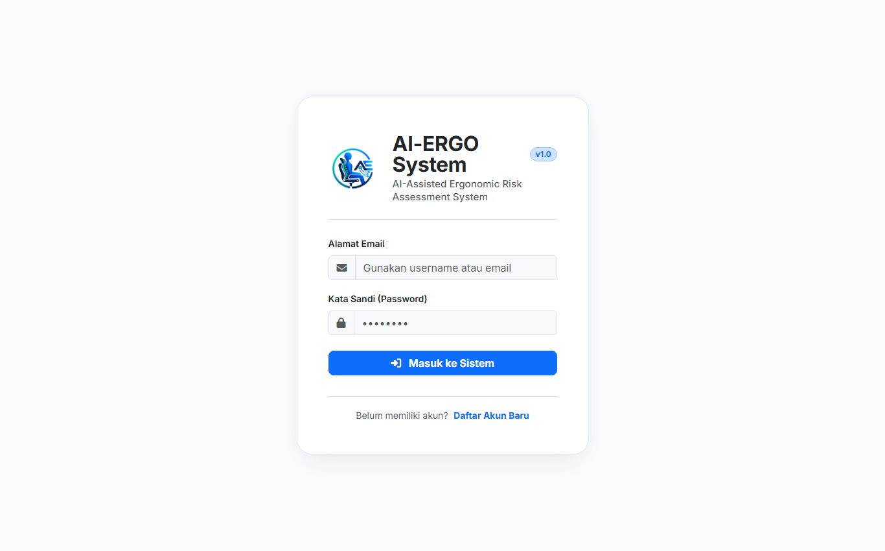

---

### Fitur 2: Dasbor Analisis Risiko & Statistik Agregat K3
* **URL:** `/dashboard`
* **Deskripsi:** Menampilkan ringkasan metrik eksekutif, meliputi total asesmen, total pekerja, rasio tingkat risiko (Rendah, Sedang, Tinggi, Sangat Tinggi), diagram sebaran risiko (*donut chart*), dan grafik 10 segmen tubuh dengan keluhan tertinggi (*horizontal bar chart*).
* **Relevansi Penelitian:** Memberikan gambaran umum proporsi keluhan muskuloskeletal pada kelompok sampel sebelum dan sesudah intervensi.

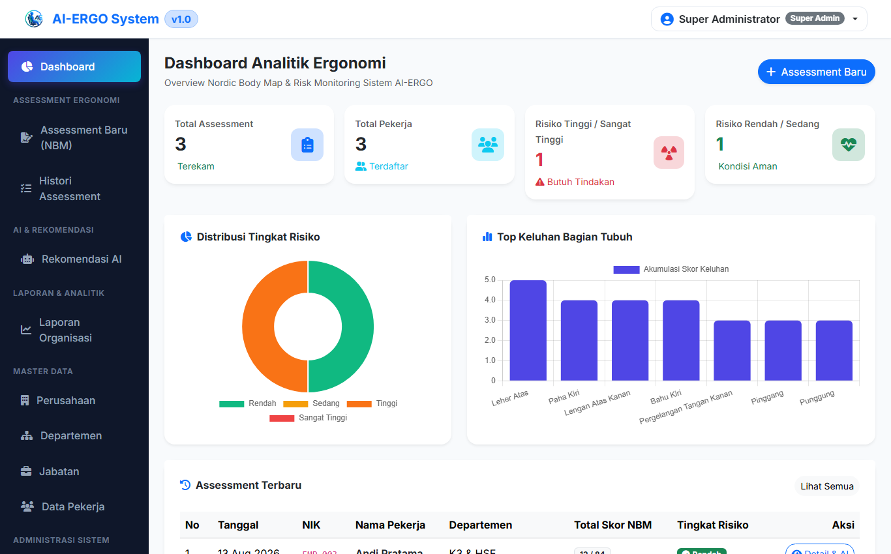

---

### Fitur 3: Manajemen Data Penilaian Nordic Body Map
* **URL:** `/assessments`
* **Deskripsi:** Tabel data rekapitulasi riwayat asesmen yang memuat identitas pekerja, departemen, total skor NBM (0–84), kategori risiko dengan *badge* warna penanda, tanggal pemeriksaan, serta aksi cepat (*Lihat Detail, Hapus*).
* **Relevansi Penelitian:** Berfungsi sebagai buku log (*logbook*) pengujian pre-test dan post-test responden secara terstruktur.

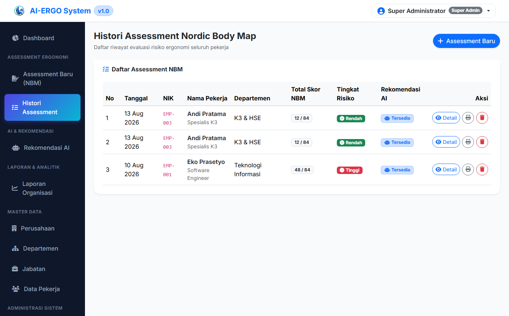

---

### Fitur 4: Formulir Evaluasi Keluhan 28 Titik Tubuh (NBM Assessment)
* **URL:** `/assessments/create`
* **Deskripsi:** Formulir digital untuk menginput derajat nyeri pada 28 area tubuh standar anatomis (Leher atas, Leher bawah, Bahu, Punggung, Pinggang, Pantat, Siku, Pergelangan tangan, Tangan, Paha, Lutut, Betis, Pergelangan kaki, Kaki). Setiap area memiliki 4 pilihan tingkat nyeri:
  * `0`: Tidak Sakit
  * `1`: Agak Sakit
  * `2`: Sakit
  * `3`: Sangat Sakit
* **Relevansi Penelitian:** Instrumen pengukuran utama variabel *Nyeri Muskuloskeletal* (*Pre-Test & Post-Test Data Collector*).

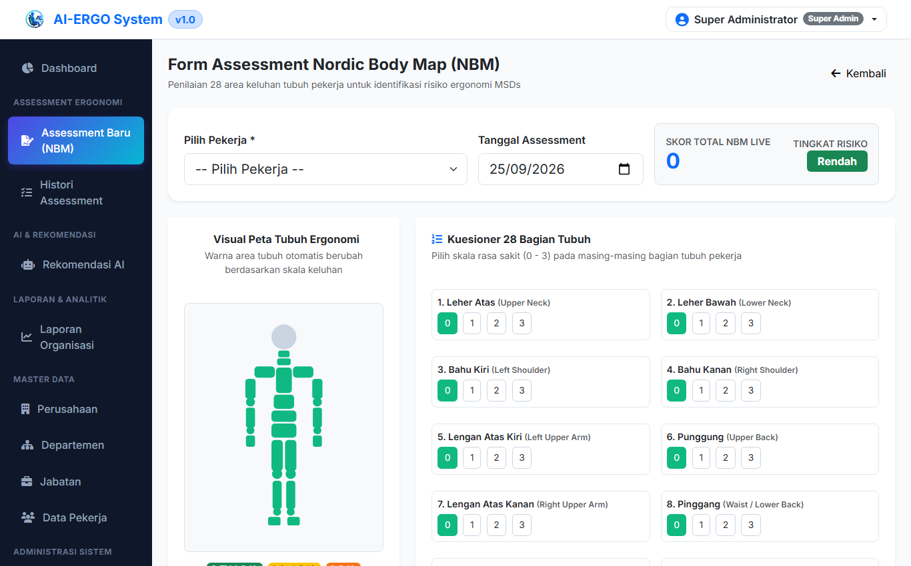

---

### Fitur 5: Detail Penilaian & Mesin Kalkulasi Skor Risiko
* **URL:** `/assessments/show/{id}`
* **Deskripsi:** Menampilkan rincian skor per regio tubuh, skor total yang dihitung secara otomatis, visualisasi level tindakan K3 (*Action Level*), serta tombol pintas untuk langsung memicu generasi rekomendasi terapi latihan fungsional berbasis AI.
* **Relevansi Penelitian:** Menjadi bukti verifikasi kuantitatif tingkat keparahan gangguan muskuloskeletal yang diderita subjek sebelum diberi protokol latihan.

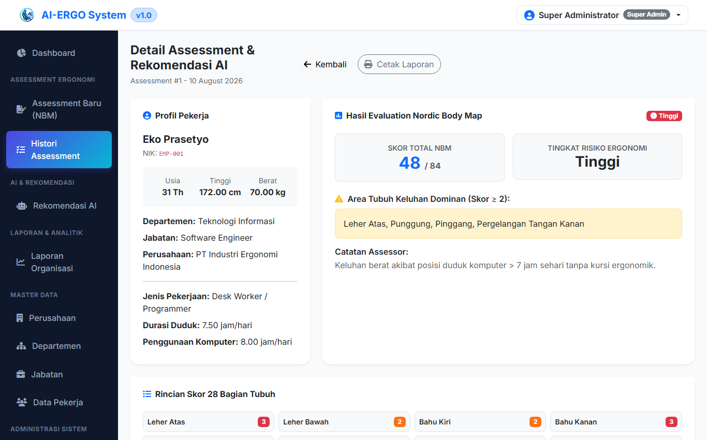

---

### Fitur 6: Engine Rekomendasi Terapi Exercise Cerdas AI
* **URL:** `/ai/generate/{id}`
* **Deskripsi:** Mengintegrasikan model LLM (*Google Gemini / Groq LLaMA-3*) untuk memproses profil pekerja dan titik nyeri NBM secara real-time. Menghasilkan preskripsi terstruktur:
  1. *Identifikasi Klaster Masalah Biomekanik*.
  2. *Protokol Terapi Gerak Fungsional* (Dekompresi, Mobilitas, Stabilisasi Inti/Scapular).
  3. *Dosis Latihan FITT* (Frekuensi harian, intensitas repetisi/tahanan, waktu durasi, tipe gerakan).
  4. *Rekomendasi Kebiasaan Ergonomi & Microbreak*.
* **Relevansi Penelitian:** Inti implementasi luaran penelitian sebagai alat perumus terapi latihan gerak fungsional terpersonalisasi.

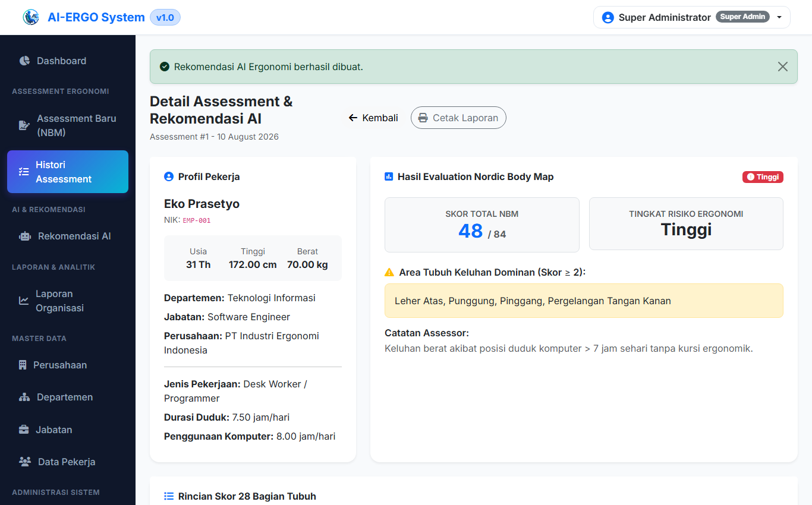

---

### Fitur 7: Manajemen Data Pekerja & Karakteristik Postural
* **URL:** `/employees`
* **Deskripsi:** Tabel manajemen data pekerja lengkap dengan filter organisasi, menampilkan NIP, nama lengkap, departemen, jabatan, usia, jenis kelamin, serta indikator beban jam kerja statis.
* **Relevansi Penelitian:** Mengelola data populasi dan sampel penelitian agar mudah dikelompokkan berdasarkan unit kerja atau kriteria inklusi.

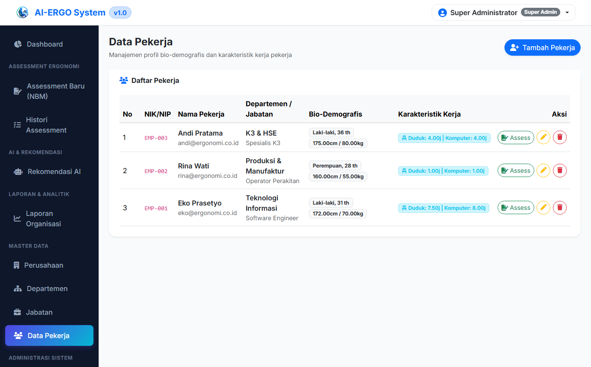

---

### Fitur 8: Formulir Profil Antropometri & Beban Postural Kerja
* **URL:** `/employees/create`
* **Deskripsi:** Formulir pencatatan karakteristik fisik (Tinggi Badan, Berat Badan, kalkulasi otomatis BMI) dan karakteristik paparan postural kerja harian:
  * Rata-rata jam duduk per hari (*sitting hours*).
  * Rata-rata jam berdiri per hari (*standing hours*).
  * Rata-rata jam interaksi dengan layar/komputer (*screen hours*).
* **Relevansi Penelitian:** Instrumen pengukuran variabel *Aktivitas Postural* (Faktor Prediktor / Risiko).

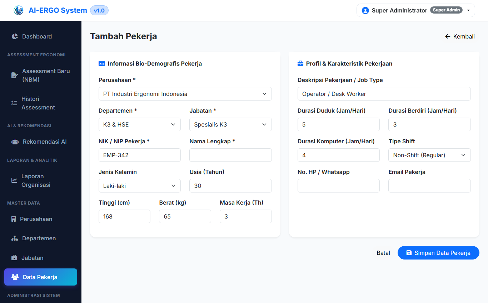

---

### Fitur 9: Laporan Risiko Ergonomi Organisasi / Departemen
* **URL:** `/reports/organization`
* **Deskripsi:** Laporan agregat tingkat risiko departemen, perbandingan skor rata-rata NBM antar divisi, dan persentase pekerja yang membutuhkan tindakan intervensi segera.
* **Relevansi Penelitian:** Mendukung analisis deskriptif populasi penelitian dalam laporan hasil dan pembahasan.

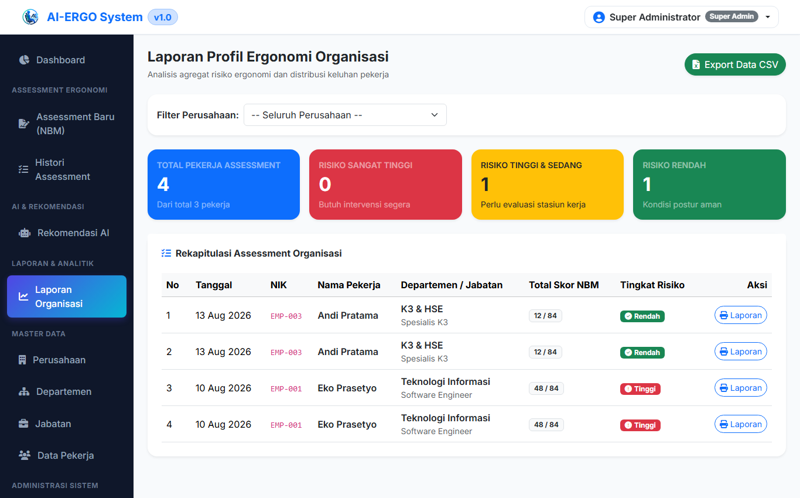

---

### Fitur 10: Laporan Rekam Medis & K3 Individual (Format Cetak)
* **URL:** `/reports/individual/{id}`
* **Deskripsi:** Lembar rekam medis dan K3 siap cetak (*Print-Ready Layout*) yang memuat data komprehensif pekerja, hasil evaluasi 28 titik NBM, skor risiko, serta lembar instruksi terapi latihan gerak fungsional untuk dibawa pulang atau dipasang di meja kerja subjek.
* **Relevansi Penelitian:** Berfungsi sebagai lembar panduan mandiri (*home-program exercise card*) yang diberikan kepada responden penelitian.

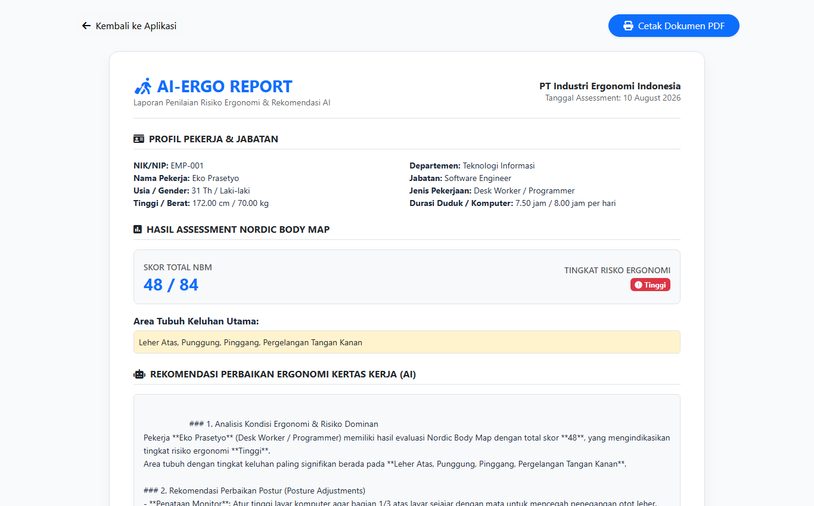

---

### Fitur 11: Manajemen Pengguna & Hak Akses Berjenjang (RBAC)
* **URL:** `/admin/users`
* **Deskripsi:** Modul kontrol hak akses pengguna, mendukung pengaturan peran (Super Admin, HSE, HRD, Ergonomist, Employee), status akun, serta fitur *User Impersonation* untuk memungkinkan tenaga ahli meninjau tampilan dari sisi pekerja.
* **Relevansi Penelitian:** Mendukung skenario multi-stakeholder dalam uji coba klinis (peneliti sebagai admin, fisioterapis sebagai ergonomist, dan pekerja sebagai subjek intervensi).

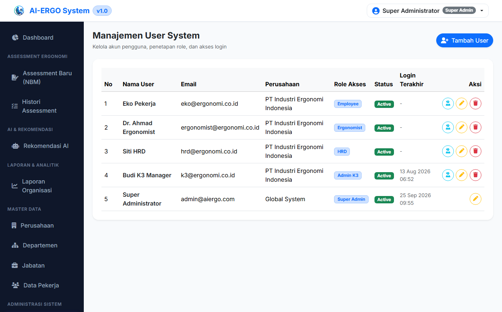

---

### Fitur 12: Pengaturan Konfigurasi AI Provider (Gemini / Groq)
* **URL:** `/admin/settings`
* **Deskripsi:** Panel antarmuka untuk mengatur kunci API (*Google Gemini API Key* dan *Groq API Key*), memilih model LLM bawaan (`gemini-1.5-flash`, `llama-3.3-70b-versatile`), suhu (*temperature*), dan batas token tanpa perlu memodifikasi kode program. Dilengkapi sistem *fallback engine* lokal jika kuota habis.
* **Relevansi Penelitian:** Memudahkan peneliti menguji coba berbagai model AI dan menyesuaikan parameter inferensi untuk akurasi rekomendasi latihan fungsional.

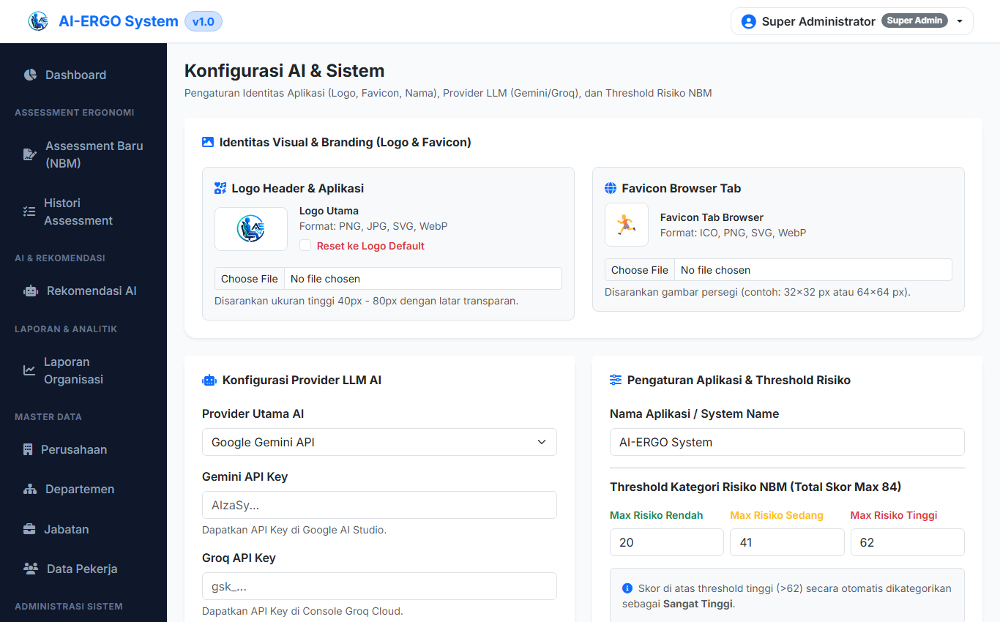

---

### Fitur 13: Audit Trail & Catatan Rekam Aktivitas (Security Logs)
* **URL:** `/admin/audit-logs`
* **Deskripsi:** Pencatatan otomatis seluruh riwayat aktivitas sistem, mencakup identitas pengguna, modul yang diakses, jenis aksi (*CREATE, UPDATE, DELETE, LOGIN*), alamat IP, serta stempel waktu presisi.
* **Relevansi Penelitian:** Menjamin integritas dan ketertelusuran data (*data traceability*) selama pengumpulan data penelitian berlangsung guna memvalidasi keaslian data eksperimen.

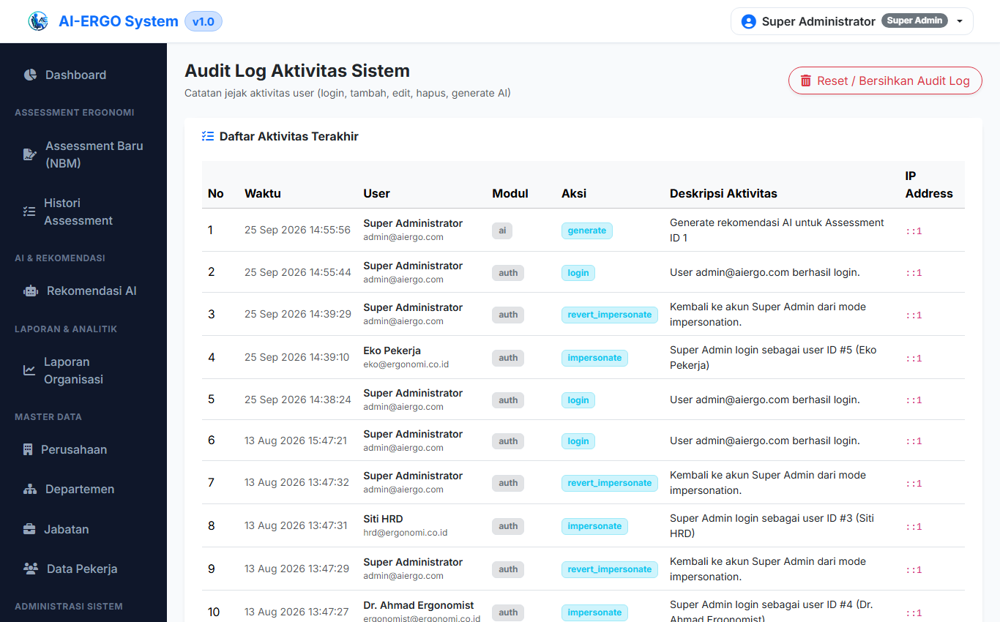

---

## KESIMPULAN

Dokumentasi tangkapan layar di atas membuktikan bahwa perangkat lunak **AI-ERGO** telah berfungsi secara penuh (*fully functional*) dan siap dijadikan sebagai instrumen produk luaran terapan yang menyokong penelitian **"Pengembangan Protokol Terapi Exercise Berbasis Gerak Fungsional terhadap Penurunan Nyeri dan Peningkatan Fungsi pada Gangguan Muskuloskeletal Akibat Aktivitas Postural"**.
