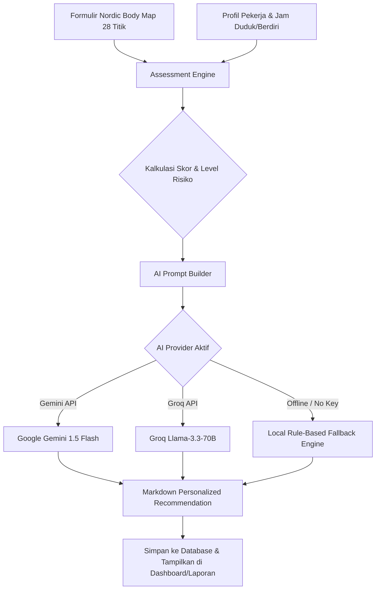

# 🦾 AI-ERGO System

> **AI-Assisted Ergonomic Risk Assessment System Using Nordic Body Map and Large Language Models for Personalized Workplace Recommendations**

[](https://php.net)
[](https://mysql.com)
[](https://getbootstrap.com)
[](https://ai.google.dev/)
[](LICENSE)

---

## 📌 Daftar Isi

1. [Tentang Sistem](#-tentang-sistem)
2. [Fitur Utama](#-fitur-utama)
3. [Arsitektur & Tech Stack](#-arsitektur--tech-stack)
4. [Tingkatan Hak Akses (Role & Permission)](#-tingkatan-hak-akses-role--permission)
5. [Metode Nordic Body Map (NBM) & Skoring](#-metode-nordic-body-map-nbm--skoring)
6. [Integrasi Artificial Intelligence (LLM)](#-integrasi-artificial-intelligence-llm)
7. [Persyaratan Sistem (Prerequisites)](#-persyaratan-sistem-prerequisites)
8. [Panduan Instalasi & Setup](#-panduan-instalasi--setup)
9. [Akun Pengguna Bawaan (Default Credentials)](#-akun-pengguna-bawaan-default-credentials)
10. [Konfigurasi AI Provider (Gemini / Groq)](#-konfigurasi-ai-provider-gemini--groq)
11. [Struktur Folder Proyek](#-struktur-folder-proyek)
12. [Dokumentasi & Diagram Teknis](#-dokumentasi--diagram-teknis)

---

## 📖 Tentang Sistem

**AI-ERGO** adalah platform sistem informasi berbasis web untuk penilaian risiko ergonomi kerja dan pencegahan keluhan *Musculoskeletal Disorders* (MSDs) pada pekerja. Sistem ini mengombinasikan kuesioner terstandar **Nordic Body Map (NBM) 28 Bagian Tubuh** dengan kapabilitas pemrosesan bahasa alami dari **Large Language Model (Google Gemini & Groq/Llama-3)** untuk menghasilkan analisis risiko dan rekomendasi perbaikan ergonomi tempat kerja yang personal dan kontekstual.

Sistem ini ditujukan untuk organisasi, praktisi K3 (*Health, Safety & Environment*), HRD, dokter/ahli ergonomi, serta peneliti di bidang keselamatan kerja dan ergonomi industri.

---

## ✨ Fitur Utama

- 🏢 **Multi-Organization & Multi-Tenant**: Pengelolaan hierarki multi-perusahaan, departemen, dan jabatan.
- 👥 **Manajemen Profil Pekerja Komprehensif**: Pencatatan data antropometri (usia, jenis kelamin, TB, BB, BMI, masa kerja) dan karakteristik beban kerja harian (jam duduk, jam berdiri, jam interaksi komputer, shift kerja).
- 📋 **Digital Nordic Body Map Assessment**: Formulir evaluasi keluhan 28 segmen tubuh dengan visualisasi tingkat keparahan (0: Tidak Sakit, 1: Agak Sakit, 2: Sakit, 3: Sangat Sakit).
- 🧮 **Automated Risk Engine**: Perhitungan skor total NBM otomatis (0–84), penentuan level risiko (*Rendah, Sedang, Tinggi, Sangat Tinggi*), serta identifikasi area tubuh dengan keluhan dominan.
- 🤖 **AI-Powered Recommendation Generator**: Integrasi API LLM cerdas (Google Gemini & Groq LLaMA-3) dengan *fallback engine* lokal otomatis untuk menghasilkan saran tindakan postur, stretching/microbreak, peralatan ergonomis, dan rencana preventif.
- 📊 **Dashboard & Visual Analytics**: Statistik real-time, visualisasi grafik sebaran risiko MSDs, dan grafik batang 10 keluhan tubuh teratas menggunakan Chart.js.
- 📄 **Pelaporan & Ekspor Data**:
  - Cetak Laporan Individual Assessment & Rekomendasi AI (format dokumen rekam K3).
  - Laporan Rekapitulasi Tingkat Risiko Organisasi/Departemen.
  - Ekspor data assessment ke format file spreadsheet CSV/Excel.
- 🔐 **Role-Based Access Control (RBAC) & Impersonasi Akun**: Hak akses granular dan kemampuan Super Admin beralih peran sementara (*User Impersonation*) untuk keperluan audit/troubleshooting.
- 📜 **Audit Trail & Activity Log**: Pencatatan riwayat aktivitas pengguna, alamat IP, dan waktu eksekusi secara otomatis.

---

## 🏗️ Arsitektur & Tech Stack

AI-ERGO dibangun dengan arsitektur **MVC (Model-View-Controller)** yang modular dan *clean-coded* tanpa bergantung pada framework berat (*lightweight native PHP*):

| Komponen | Teknologi | Keterangan |
| :--- | :--- | :--- |
| **Backend Core** | PHP 8.0+ (Native MVC) | Custom Router, Middleware, Service Layer, PDO Database Singleton |
| **Database** | MySQL 5.7+ / MariaDB 10.3+ | InnoDB Engine, Foreign Key Cascades, Indexing |
| **Frontend UI** | HTML5, Vanilla CSS3, JavaScript (ES6) | Clean Design System, Glassmorphism Cards, Responsive Layout |
| **UI Framework** | Bootstrap 5.3 + Bootstrap Icons | Grid System, Modals, Forms, Alerts |
| **Chart & Visual** | Chart.js 4.x | Donut Chart & Horizontal Bar Chart untuk analitik |
| **AI / LLM Integration** | Google Gemini API & Groq API | cURL-based REST Client dengan fallback otomatis |
| **Keamanan** | Bcrypt, PDO Prepared Statements, CSRF Guard | Anti-SQL Injection & Sanitasi XSS |

---

## 👥 Tingkatan Hak Akses (Role & Permission)

Sistem membedakan hak akses pengguna menjadi 5 level peran:

| No | Peran (Role) | Hak Akses Utama |
| :---: | :--- | :--- |
| 1 | **Super Administrator** | Akses penuh: Kelola perusahaan, master data, konfigurasi sistem & API AI, kelola seluruh pengguna, impersonasi akun, dan pembersihan audit log. |
| 2 | **Admin K3 (HSE Officer)** | Kelola data pekerja, input assessment NBM, generate rekomendasi AI, cetak laporan medis K3, dan ekspor data organisasi. |
| 3 | **HRD** | Monitoring dashboard statistik risiko kerja, evaluasi data karyawan, dan melihat laporan agregat departemen. |
| 4 | **Ergonomist / Ahli Ergonomi** | Tinjauan teknis assessment, validasi hasil risiko NBM, dan evaluasi rekomendasi perbaikan berbasis AI. |
| 5 | **Pekerja (Employee)** | Melakukan self-assessment keluhan tubuh mandiri dan melihat riwayat hasil penilaian pribadi. |

---

## 🧮 Metode Nordic Body Map (NBM) & Skoring

Assessment mengevaluasi **28 titik tubuh standar** dengan skala 4 poin:

```
Bobot Nilai:
0 = Tidak Sakit (No Pain)
1 = Agak Sakit (Mild Discomfort)
2 = Sakit (Moderate Pain)
3 = Sangat Sakit (Severe Pain)
```

### Klasifikasi Tingkat Risiko (Action Levels):

$$\text{Total Skor} = \sum_{i=1}^{28} \text{Skor Bagian Tubuh}_i \quad (\text{Skala: } 0 - 84)$$

| Total Skor NBM | Kategori Risiko | Rekomendasi Tindakan K3 |
| :---: | :---: | :--- |
| **0 – 20** | 🟢 **Rendah (Low)** | Tidak diperlukan perbaikan segera; lakukan pemeliharaan postur kerja yang baik. |
| **21 – 41** | 🟡 **Sedang (Medium)** | Diperlukan perbaikan di masa mendatang (*action may be needed*). |
| **42 – 62** | 🟠 **Tinggi (High)** | Diperlukan perbaikan segera (*action needed soon*) pada stasiun kerja. |
| **63 – 84** | 🔴 **Sangat Tinggi (Very High)** | Diperlukan tindakan perbaikan menyeluruh saat ini juga (*immediate action needed*). |

---

## 🤖 Integrasi Artificial Intelligence (LLM)

AI-ERGO meramu data pekerja (usia, BMI, masa kerja, jam duduk/berdiri, jam komputer) dan hasil 28 titik NBM menjadi *engineered prompt* terstruktur, lalu mengirimkannya ke LLM untuk menghasilkan 5 pilar rekomendasi:



### 5 Pilar Rekomendasi AI:
1. **Analisis Kondisi Ergonomi & Risiko Dominan**: Penjelasan dampak klinis berdasarkan beban kerja harian.
2. **Rekomendasi Perbaikan Postur (*Posture Adjustments*)**: Penyesuaian sudut pandang monitor, posisi duduk, siku, dan kaki.
3. **Rekomendasi Aktivitas & Peregangan (*Stretching & Microbreak*)**: Panduan aturan 20-20-20, peregangan leher (*chin tucks*), lumbar stretch, dan jeda berkala.
4. **Rekomendasi Peralatan & Workstation Ergonomi**: Rekomendasi kursi lumbar support, mouse vertikal, footrest, dsb.
5. **Tindakan Preventif & Evaluasi Berkelanjutan**: Jadwal asesmen berkala (30/60 hari) dan pelatihan ergonomi.

---

## 💻 Persyaratan Sistem (Prerequisites)

- **Web Server**: Apache dengan modul `mod_rewrite` aktif (misal: XAMPP, WampServer, Laragon).
- **PHP**: Versi **8.0** atau lebih baru.
  - Ekstensi PHP wajib aktif: `pdo_mysql`, `curl`, `openssl`, `mbstring`, `json`.
- **Database**: MySQL versi **5.7+** atau MariaDB **10.3+**.
- **Web Browser**: Google Chrome, Mozilla Firefox, Microsoft Edge, atau Safari versi modern.

---

## 🚀 Panduan Instalasi & Setup

### Langkah 1: Kloning / Tempatkan File Proyek
Pastikan folder proyek berada pada direktori web root server lokal Anda:
```bash
# Untuk XAMPP di Windows:
C:\xampp\htdocs\ergonomi
```

### Langkah 2: Buat Database & Import Skema
1. Buka browser dan akses **phpMyAdmin** (`http://localhost/phpmyadmin`).
2. Buat database baru bernama `ai_ergo` dengan collation `utf8mb4_unicode_ci`.
3. Import file `database.sql` yang berada di root folder proyek:
   ```bash
   # Melalui terminal MySQL (opsional):
   mysql -u root -p ai_ergo < c:/xampp/htdocs/ergonomi/database.sql
   ```

### Langkah 3: Konfigurasi Koneksi Database
Periksa dan sesuaikan file `config/database.php` jika menggunakan username/password MySQL yang berbeda:
```php
return [
    'host'     => '127.0.0.1',
    'port'     => 3306,
    'dbname'   => 'ai_ergo',
    'username' => 'root',
    'password' => '',
    'charset'  => 'utf8mb4',
];
```

### Langkah 4: Verifikasi dengan Script Diagnostik
Jalankan file diagnostik bawaan untuk memastikan koneksi database, data seeder, dan hash password siap digunakan:
- Buka terminal:
  ```bash
  php c:\xampp\htdocs\ergonomi\diagnose.php
  ```
- Hasil harus menunjukkan `[OK] Database connection successful` dan `[OK] Password verification: PASS`.

### Langkah 5: Jalankan & Akses Aplikasi
1. Nyalakan service **Apache** dan **MySQL** di XAMPP Control Panel.
2. Buka browser dan navigasikan ke URL:
   ```
   http://localhost/ergonomi/
   ```

---

## 🔑 Akun Pengguna Bawaan (Default Credentials)

Semua akun demo di bawah ini menggunakan kata sandi standar: `password123`

| Peran (Role) | Email Login | Password | Fungsi Akun |
| :--- | :--- | :--- | :--- |
| **Super Admin** | `admin@aiergo.com` | `password123` | Konfigurasi sistem penuh, API Key, kelola pengguna |
| **Admin K3 (HSE)** | `k3@ergonomi.co.id` | `password123` | Pengelolaan data karyawan & input assessment |
| **HRD** | `hrd@ergonomi.co.id` | `password123` | Monitoring risiko kerja & laporan departemen |
| **Ergonomist** | `ergonomist@ergonomi.co.id` | `password123` | Validasi klinis & telaah rekomendasi perbaikan |
| **Pekerja** | `eko@ergonomi.co.id` | `password123` | Self-assessment keluhan ergonomi mandiri |

---

## ⚙️ Konfigurasi AI Provider (Gemini / Groq)

Anda dapat mengaktifkan AI rekomendasi berbasis cloud secara langsung melalui antarmuka web tanpa perlu menyentuh file kode:

1. Login sebagai **Super Administrator** (`admin@aiergo.com`).
2. Masuk ke menu **Pengaturan Sistem** (`/admin/settings`).
3. Pada tab **Konfigurasi AI / LLM**:
   - **Pilih Provider Utama**: `Google Gemini` atau `Groq API`.
   - **Google Gemini API Key**: Masukkan API key dari [Google AI Studio](https://aistudio.google.com/).
   - **Groq API Key**: Masukkan API key dari [Groq Console](https://console.groq.com/).
   - **Default Model**: Pilih `gemini-1.5-flash` atau `llama-3.3-70b-versatile`.
4. Klik **Simpan Pengaturan**.

> **Catatan**: Jika API Key belum diisi atau kuota API habis, sistem akan secara otomatis mengaktifkan **Local Fallback Engine** berbasis *expert rules* sehingga aplikasi tetap dapat beroperasi 100% tanpa error.

---

## 📁 Struktur Folder Proyek

```text
ergonomi/
├── app/
│   ├── Controllers/        # Logika handler request (Auth, Dashboard, Assessment, AI, Report, User, dll.)
│   ├── Helpers/            # Helper fungsi global (Auth, URL, Formatting, View renderer)
│   ├── Middleware/         # Filter keamanan (AuthMiddleware, RoleMiddleware)
│   ├── Models/             # Model data PDO (User, Employee, Assessment, Company, Setting, dll.)
│   └── Services/           # Logic Engine (AssessmentEngine.php & AIService.php)
├── config/
│   ├── ai.php              # Konfigurasi parameter LLM & endpoint
│   ├── app.php             # Pengaturan umum aplikasi & URL base
│   └── database.php        # Kredensial koneksi PDO MySQL
├── core/
│   ├── App.php             # Inisialisasi aplikasi
│   ├── Controller.php      # Base controller
│   ├── Database.php        # Database Singleton wrapper
│   ├── Model.php           # Base model PDO
│   └── Router.php          # Request routing engine
├── public/
│   ├── assets/             # File CSS kustom, JavaScript, dan library pendukung
│   ├── uploads/            # Direktori berkas unggahan pengguna/logo
│   ├── .htaccess           # URL rewrite rules untuk Apache
│   ├── index.php           # Front controller utama
│   ├── activity_diagram.jpg # Dokumentasi alur proses
│   ├── usecase_diagram.jpg  # Dokumentasi use case sistem
│   └── wireframe_*.jpg     # Rancangan antarmuka visual
├── resources/
│   └── views/              # Template tampilan (Blade-like PHP Views)
│       ├── admin/          # Tampilan manajemen user, roles, settings, audit-log
│       ├── ai/             # Tampilan riwayat & detail rekomendasi AI
│       ├── assessments/    # Formulir Nordic Body Map & hasil penilaian
│       ├── auth/           # Halaman login & registrasi
│       ├── companies/      # Master data perusahaan
│       ├── dashboard/      # Dashboard analitik & KPI
│       ├── departments/    # Master data departemen
│       ├── employees/      # Master data pekerja & profil beban kerja
│       ├── layouts/        # Header, Sidebar, Navbar, Footer master layout
│       ├── positions/      # Master data jabatan
│       └── reports/        # Laporan individual & agregat organisasi
├── database.sql            # Skema lengkap DDL & data seeder awal
├── diagnose.php            # Script verifikasi mandiri kesehatan sistem
├── PRD.md                  # Product Requirements Document
├── design.md               # Spesifikasi arsitektur & desain teknis
├── erd.md                  # Entity Relationship Diagram & penjelasan tabel
├── usecase.md              # Spesifikasi use case & interaksi aktor
└── README.md               # Dokumentasi utama proyek
```

---

## 📊 Dokumentasi & Diagram Teknis

Dokumentasi rancangan sistem dan diagram arsitektur lengkap telah disertakan dalam repositori:

- 📄 **PRD (Product Requirements Document)**: [PRD.md](PRD.md)
- 📐 **Technical Design Document**: [design.md](design.md)
- 🗄️ **Entity Relationship Diagram (ERD)**: [erd.md](erd.md)
- 🔄 **Use Case Specification**: [usecase.md](usecase.md)
- 🖼️ **Visual Assets & Wireframe**:
  - `public/usecase_diagram.jpg`
  - `public/activity_diagram.jpg`
  - `public/wireframe_1_login_dashboard_assessment.jpg`
  - `public/wireframe_2_result_ai_employees.jpg`

---

## 📄 Lisensi

Proyek ini dikembangkan untuk kebutuhan riset, publikasi ilmiah, dan implementasi Keselamatan dan Kesehatan Kerja (K3). Dirilis di bawah lisensi [MIT License](LICENSE).
